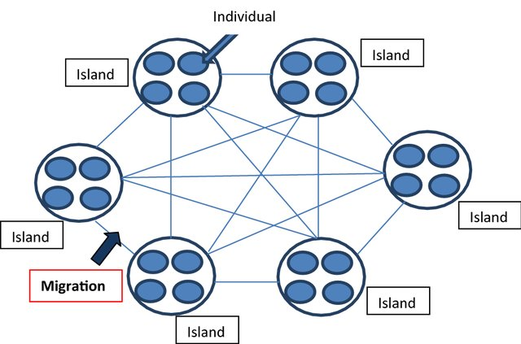

# Parallelization strategies on Genetic Algorithms to solve the Traveling Salesman Problem

## Genetic Approach:

The so called Genetic Algorithm is a method, based on natural selection inspired techniques, capable of finding optimal/sub-optimal solutions to both constrained and unconstrained optimization problems. The algorithm is based on the idea of evolution, where the fittest individuals are selected for reproduction in order to produce offspring of the next generation. The algorithm generally is composed of the following steps:

- **Initialization**: The initial population is generated randomly (regularity might be imposed depending on the problem).

- **Evaluation**: The fitness of each individual in the population is evaluated.

- **Selection**: Fittest individuals are selected for reproduction.

- **Crossover**: The selected individuals are combined to produce offspring, according to several existing techniques.

- **Mutation**: The offspring is mutated to introduce diversity in the population.

- **Replacement**: The offspring replaces the worst individuals in the population.

- **Termination**: The algorithm stops when a stopping criterion is met.

Given the absence of pre-defined euristic rules, the Genetic Algorithm offers a flexible and robust infrastructure to solve optimization problems, but lacks any guarantee of convergence to the global optimum, resulting often in long computational times.

## Island Model:

The evolution environment of individuals in a Genetic Algorithm is a crucial aspect that can greatly affect both computational costs and results. The Island Model is an organization strategy that divides the population into several sub-populations, called islands, each evolving independently. Such subdivision of independent tasks can allow for a more efficient exploration of the search space and offers the important possibility to distribute computation loads among different computing uinits. The islands can bes further periodically connected to exchange information, in order to allow for a global exploration of the search space.

<small><i>
Subbaraj, Saroja & T., Revathi. (2020). Hybrid dual-objective parallel genetic algorithm for heterogeneous multiprocessor scheduling. Cluster Computing. 23. 10.1007/s10586-019-02934-0. 
</small></i>

## 2D Euclidean Traveling Salesman Problem:

The Traveling Salesman Problem (TSP) is a well-known combinatorial optimization problem, where the goal is to find the shortest possible route that visits a given set of cities and returns to the origin city. The problem is NP-hard, meaning that no polynomial time algorithm is known to solve it optimally.
In the specific case of the 2D Euclidean TSP, the cities are represented as points in a 2D plane, and the distance between two cities is given by the Euclidean distance between them.
Given the nature of the problem, the Genetic Algorithm offfers a good tradeof between computational costs and results.

## Parallelization Strategies:
